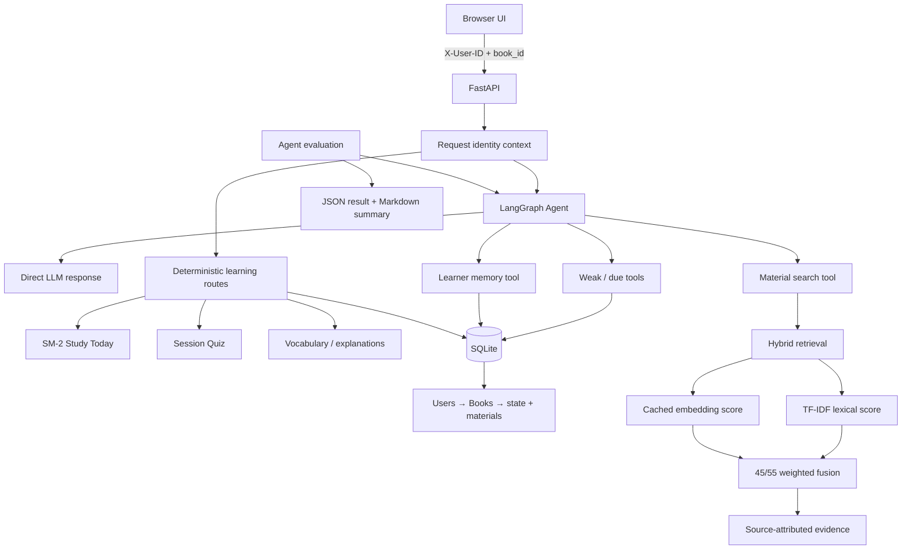

# LangBuddy — Agentic AI Language Learning Assistant

LangBuddy is a personalized language-learning workspace built around one LangGraph Agent and a deterministic learning layer. It supports direct language questions, learner-aware tool calling, durable preferences, hybrid retrieval over uploaded materials, SM-2 study sessions, quizzes, and vocabulary exploration.

## Key features

- Global Agent Chat with optional vocabulary-word context
- Weak-word, due-review, learner-memory, and material-search tools
- Explicit `User → Books → learner state/materials` ownership in SQLite
- Safe copy-only migration from existing JSON learner state
- Persistent preferences, goals, and recurring confusions
- Hybrid lexical + embedding retrieval over PDF, TXT, Markdown, and CSV
- Cached chunk embeddings and source-attributed answers
- SM-2 review, session quizzes, morphology grouping, explanations, and feedback
- Deterministic Agent evaluation plus a separate optional live-model suite

## Architecture



`user_id` comes from the request header and `book_id` from the application route. Neither is exposed as a model-selectable Tool argument. SM-2 grading, quizzes, material mutation, and explicit memory writes remain deterministic backend operations outside the Agent.

## Tech stack

- Python 3.10+, FastAPI, and Uvicorn
- LangGraph, LangChain Core, and LangChain OpenAI
- SQLite from the Python standard library
- OpenAI chat and embedding APIs, with lexical retrieval fallback
- pypdf for PDF extraction
- Vanilla HTML, CSS, and JavaScript
- Pytest

## Setup

```bash
git clone <your-repository-url>
cd linguapilot-core-vocab-dev
python3 -m venv .venv
source .venv/bin/activate
python -m pip install --upgrade pip
pip install -r requirements.txt
cp .env.example .env
uvicorn app.main:app --reload --host 127.0.0.1 --port 8000
```

Set `OPENAI_API_KEY` in `.env`. Chat defaults to `gpt-4o-mini`; embeddings default to `text-embedding-3-small` with 256 dimensions. Set `LANGBUDDY_EMBEDDINGS=disabled` for lexical-only/offline operation.

Open [http://127.0.0.1:8000](http://127.0.0.1:8000). Health is available at [http://127.0.0.1:8000/health](http://127.0.0.1:8000/health).

## Persistence and identity

SQLite is stored at `state/langbuddy.sqlite3` by default and excluded from Git.

- `X-User-ID` selects the learner identity; the browser uses `local-user` by default.
- Each user owns independent books, learner state, memory, chats, and material indexes.
- Identity is not authentication. Production deployment needs a trusted authentication layer before accepting this header from untrusted clients.
- On first startup, legacy `state/*.json` and material stores are copied into SQLite for `local-user`. Files are retained. If a migrated file later changes, startup reports a conflict instead of overwriting either copy.

`LANGBUDDY_DB_PATH` can point to another SQLite location. Application code uses a narrow repository interface so a future PostgreSQL adapter does not require rewriting learning features.

## Docker

```bash
docker build -t langbuddy .
docker run --rm -p 8000:8000 \
  -e OPENAI_API_KEY="$OPENAI_API_KEY" \
  -e OPENAI_MODEL="gpt-4o-mini" \
  -v "$(pwd)/state:/app/state" \
  langbuddy
```

The explicit state volume preserves SQLite across container replacement. Do not mount or publish a directory containing learner data unless that is intentional.

## Demo workflow

1. In **Vocabulary**, select/import a book and browse morphology groups.
2. Ask the **Learning Assistant** a general question without selecting a word.
3. Optionally use a vocabulary word as chat focus.
4. Upload a source in **Materials**, then ask the Assistant to use it.
5. Complete due and new cards in **Study Today** and use **Quiz** for practice.

Example prompts: `What are my weak words?`, `What should I review today?`, `I prefer short answers with examples.`, `Use my uploaded notes to explain passive voice.`, and `What is the difference between affect and effect?`.

## Testing and Agent evaluation

Run the complete deterministic regression suite:

```bash
pytest -q
```

Run the deterministic evaluation. It executes the real graph, Tools, SQLite repository, memory view, RAG retrieval, and fallback path with a fixed routing model:

```bash
python -m app.evaluation --mode deterministic \
  --json-output evaluation_results/deterministic.json \
  --summary-output evaluation_results/deterministic.md
```

The committed JSON and Markdown baseline reports cover correct/no Tool selection, weak/due routing, learner memory, RAG routing, source attribution, user/book isolation, and graceful fallback.

The live-model suite is separate and optional because routing is probabilistic and requires API access:

```bash
python -m app.evaluation --mode live \
  --json-output evaluation_results/live.json \
  --summary-output evaluation_results/live.md
```

No LLM judge is used. Live answers use the same explicit Tool trace and evidence checks.

Additional release checks:

```bash
python -m compileall -q app tests
node --check static/app.js
git diff --check
```

## Design decisions

- **Bounded Tool evidence:** the Agent does not receive entire learner documents in its prompt.
- **Runtime ownership context:** `user_id` and `book_id` are injected by the application.
- **Deterministic writes:** the LLM cannot freely author scores or durable memory.
- **Conservative migration:** JSON import is copy-only, checksummed, and conflict-aware.
- **Hybrid retrieval without a vector database:** persisted vectors add semantic recall while lexical fallback and weighted fusion remain inspectable.
- **One Agent:** multi-Agent orchestration is intentionally excluded.
- **Observable evaluation:** a detailed runner exposes Tool names while the chat API still returns plain text.

## Project structure

- `app/storage.py`: SQLite repository and legacy JSON migration
- `app/agent.py`: LangGraph workflow, Tools, and observable run result
- `app/evaluation.py`: deterministic and optional live-model evaluation runner
- `app/chat.py`: global and word-specific chat persistence/fallback
- `app/memory.py`: explicit, bounded learner memory
- `app/materials.py`: extraction, cached embeddings, and hybrid retrieval
- `app/sm2.py` and `app/session_quiz.py`: deterministic study logic
- `evaluation_results/`: committed deterministic JSON/Markdown baseline
- `static/`: framework-free product UI
- `tests/`: storage, retrieval, Agent, and evaluation regression tests

## Current boundaries

- User identity is stable and isolated but is not authentication or authorization.
- SQLite suits this local/single-service project; horizontal multi-writer deployment needs a server database adapter.
- Semantic retrieval needs a configured embedding API; lexical retrieval remains operational without it.
- Memory extraction accepts only an allowlist of explicit durable statements.
- Runtime SQLite databases and generated material/quiz indexes are excluded from releases; legacy JSON migration inputs remain preserved and are not rewritten by productionization commits.
