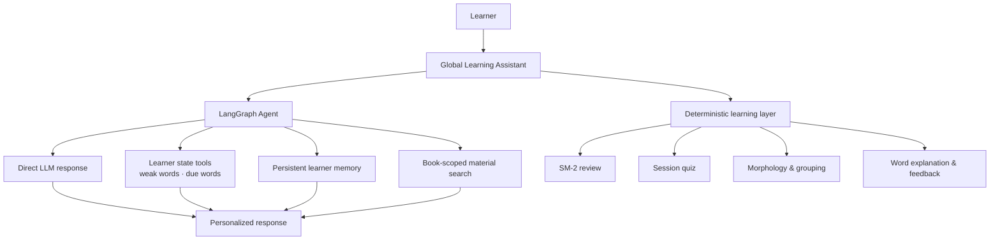

# LangBuddy — Agentic AI Language Learning Assistant

LangBuddy is a personalized language-learning workspace built around one LangGraph agent and a deterministic learning layer. The assistant can answer general language questions directly, inspect book-scoped learner progress through tools, remember explicit learning preferences, and retrieve source-attributed evidence from uploaded materials.

The project combines learner-aware tool calling and persistent memory with practical vocabulary workflows: SM-2 review, session quizzes, morphology-based grouping, explanations, and optional word focus.

## Key features

- Global Agent Chat that works without selecting a vocabulary word
- Context-aware routing between direct LLM responses and learner tools
- Evidence-based weak-word and due-review selectors
- Persistent, explicit learner preferences, goals, and recurring confusions
- Book-scoped retrieval over PDF, TXT, Markdown, and CSV materials
- Source attribution for material-grounded answers
- SM-2 manual review and quiz-to-card updates
- Session quizzes with targeted feedback
- Morphology/grouping and word explanations
- Optional word focus that adds context without restricting the conversation
- Responsive, framework-free product UI

## Architecture



The current `book_id` is supplied by the application runtime, not chosen by the model. Tools read only the state belonging to that book. Review and quiz writes remain in deterministic backend routes outside the Agent.

## Tech stack

- Python 3.10+
- FastAPI and Uvicorn
- LangGraph, LangChain Core, and LangChain OpenAI
- OpenAI Python SDK
- Local JSON learner state and memory
- Deterministic local TF-IDF material retrieval
- pypdf for PDF text extraction
- Vanilla HTML, CSS, and JavaScript
- Pytest

## Setup

```bash
git clone <your-repository-url>
cd linguapilot-core-vocab-dev

python3 -m venv .venv
source .venv/bin/activate
python -m pip install --upgrade pip
pip install -r requirements.txt

cp .env.example .env
```

Set `OPENAI_API_KEY` in `.env`. `OPENAI_MODEL` defaults to `gpt-4o-mini` and can be changed there.

Start the application:

```bash
uvicorn app.main:app --reload --host 127.0.0.1 --port 8000
```

Open [http://127.0.0.1:8000](http://127.0.0.1:8000). The health endpoint is available at [http://127.0.0.1:8000/health](http://127.0.0.1:8000/health).

## Docker

Build the image:

```bash
docker build -t langbuddy .
```

Run with your API key from the environment:

```bash
docker run --rm -p 8000:8000 \
  -e OPENAI_API_KEY="$OPENAI_API_KEY" \
  -e OPENAI_MODEL="gpt-4o-mini" \
  langbuddy
```

Then open [http://127.0.0.1:8000](http://127.0.0.1:8000).

## Demo workflow

1. Select an existing vocabulary book, or import a CSV in **Books & Vocabulary**.
2. Open **Learning Assistant** and ask a question immediately; no word selection is required.
3. Optionally set a focus word or click a word in a vocabulary group.
4. Upload notes in **Materials**, then ask the assistant to use the uploaded source.
5. Use **Review** and **Quiz** to update deterministic learner progress.

Try these prompts:

- `What are my weak words?`
- `What should I review today?`
- `I prefer short answers with examples.`
- `What do you remember about my learning preferences?`
- `Use my uploaded notes to explain passive voice.`
- `What is the difference between affect and effect?`

## Testing

Run the deterministic test suite:

```bash
pytest -q
```

The tests cover weak/due selectors, read-only tool behavior, runtime `book_id` isolation, explicit persistent memory, memory bounds and reset behavior, material chunking and retrieval, PDF extraction, source attribution data, and cross-book material isolation.

Additional release checks:

```bash
python -m compileall -q app tests
node --check static/app.js
git diff --check
```

## Design decisions

- **Tool calling instead of raw state injection.** The Agent receives bounded, purpose-specific evidence and never gets the full learner JSON in its prompt.
- **Runtime book context.** `book_id` is injected through LangGraph runtime context, so the model cannot guess or select another learner scope.
- **Memory is separate from RAG.** Memory stores durable facts about the learner; material retrieval searches external learning content.
- **Deterministic writes.** SM-2 grading, quiz updates, material management, and explicit memory extraction are backend-controlled rather than arbitrary model writes.
- **One Agent is enough.** Multi-Agent orchestration is intentionally excluded because a single Agent with clear tools is simpler, easier to test, and sufficient for the current product.
- **Local retrieval for a local demo.** Bounded TF-IDF search provides transparent, dependency-light retrieval without a vector database.

## Project structure

```text
app/
  main.py          FastAPI application and deterministic learning routes
  agent.py         LangGraph workflow and learner/material tools
  chat.py          Global and legacy word-specific chat persistence
  memory.py        Explicit, bounded persistent learner memory
  materials.py     Book-scoped upload, extraction, chunking, and retrieval
  sm2.py           SM-2 card updates
  session_quiz.py  Quiz generation, scoring, feedback, and card updates
  morph.py         Vocabulary grouping and morphology helpers
  explain.py       Word explanation route
static/
  index.html       Product information architecture
  style.css        Responsive visual system
  app.js           Frontend application behavior
tests/
  test_agent.py
  test_materials.py
```

## Limitations

- Learner data is book-scoped; there is no user-account or `user_id` layer.
- Retrieval is local lexical TF-IDF, not semantic embedding search.
- JSON files do not provide database-grade concurrency control.
- Memory extraction intentionally recognizes only a small allowlist of explicit statements.
- Uploaded material indexes and quiz session files are local runtime data and are not committed.
