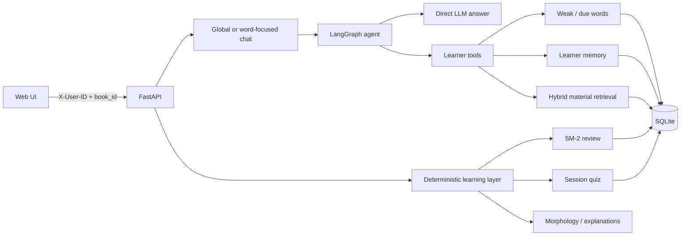

# LinguaPilot

LinguaPilot is an AI-assisted personal language-learning application built around a single LangGraph agent. It combines learner-aware tool calling with deterministic vocabulary study workflows, durable learner preferences, and source-attributed retrieval over uploaded learning materials.

## What it demonstrates

- LangGraph orchestration with optional tool calling instead of calling a learner tool on every message
- Runtime-scoped learner tools for weak words, due reviews, saved learner memory, and uploaded materials
- Explicit `User → Books → learner data` ownership backed by SQLite
- Persistent, allowlisted preferences, goals, and recurring confusions
- SM-2 review scheduling and deterministic quiz-to-card updates
- Hybrid lexical and embedding retrieval with cached chunk embeddings and source attribution
- PDF, TXT, Markdown, and CSV material ingestion
- FastAPI APIs, a lightweight vanilla JavaScript UI, and Docker support
- Deterministic agent evaluation with an optional, separately invoked live-model suite

## Architecture



SQLite stores user-owned books, JSON-compatible learner state, conversations, memory, and material indexes. Runtime databases and learner data are intentionally excluded from Git.

## Agent workflow

For a chat request, the application supplies the active `user_id`, selected `book_id`, conversation history, saved response preferences, and an optional focus word. `user_id` and `book_id` are runtime context; the model cannot choose either value as a tool argument.

The agent can:

- answer a general language question directly;
- call `get_weak_words` for evidence-backed vocabulary weaknesses;
- call `get_due_words` for already-studied cards whose review time has arrived;
- call `get_learner_memory` for saved preferences, goals, and recurring confusions;
- call `search_learning_materials` for book-scoped, source-attributed excerpts.

Tool results return bounded evidence to the agent, which then produces the final response. Writes such as SM-2 grades, quiz results, material management, and durable-memory extraction remain deterministic backend operations rather than model-authored state changes. If agent execution fails, plain chat retains a logged legacy LLM fallback.

## Retrieval and persistence

Material retrieval preserves lexical matching and optionally adds OpenAI embeddings. Results use an explicit weighted fusion of lexical and semantic scores; chunk embeddings are stored with the material index so documents are not re-embedded on every query. If embeddings are disabled or unavailable, lexical retrieval remains operational. No external vector database is required.

The default database is `state/langbuddy.sqlite3`. The storage layer enforces user/book isolation and provides a conservative, copy-only importer for older local `state/*.json` files. This public repository does not ship learner state or uploaded book copies.

## Key components

- `app/main.py` — FastAPI application, identity context, book import, review, and vocabulary routes
- `app/agent.py` — LangGraph workflow, learner/material tools, and observable tool-call trace
- `app/storage.py` — SQLite repository and legacy JSON migration
- `app/chat.py` — global and word-focused chat persistence plus fallback handling
- `app/memory.py` — conservative explicit learner-memory extraction and bounded views
- `app/materials.py` — document extraction, chunking, cached embeddings, and hybrid retrieval
- `app/sm2.py` — SM-2 card updates
- `app/session_quiz.py` — quiz generation, scoring, feedback, and card updates
- `app/morph.py` — vocabulary parsing and morphology grouping
- `app/evaluation.py` — deterministic and optional live-model agent evaluation
- `static/` — framework-free HTML, CSS, and JavaScript interface
- `tests/` — deterministic storage, agent, retrieval, migration, and evaluation tests

## Running locally

Requirements: Python 3.10 or newer.

```bash
git clone https://github.com/zhangxyqqq/linguapilot-agent.git
cd linguapilot-agent

python3 -m venv .venv
source .venv/bin/activate
python -m pip install --upgrade pip
pip install -r requirements.txt

cp .env.example .env
```

Add your own OpenAI API key to `.env` to enable LLM chat and semantic embeddings. Never commit `.env`. Configuration options are documented in the sanitized `.env.example`; set `LANGBUDDY_EMBEDDINGS=disabled` for lexical-only retrieval.

Start the application:

```bash
uvicorn app.main:app --reload --host 127.0.0.1 --port 8000
```

Open [http://127.0.0.1:8000](http://127.0.0.1:8000). On a clean checkout, import `data/book_sample.csv` from the **Vocabulary** page to create a sample book. The health endpoint is available at `/health`.

### Docker

```bash
docker build -t linguapilot .
docker run --rm -p 8000:8000 \
  -e OPENAI_API_KEY="$OPENAI_API_KEY" \
  -v "$(pwd)/state:/app/state" \
  linguapilot
```

The mounted state directory keeps the SQLite database outside the container image.

## Tests and evaluation

Run the deterministic regression suite:

```bash
pytest -q
```

At the time of this public-hardening pass, the suite contains 33 passing tests. It covers storage migration and isolation, learner selectors, memory behavior, tool schemas and routing, hybrid retrieval, PDF extraction, source attribution, fallback behavior, and the deterministic evaluation runner.

Run the deterministic agent evaluation and produce machine- and human-readable reports:

```bash
python -m app.evaluation --mode deterministic \
  --json-output evaluation_results/deterministic.json \
  --summary-output evaluation_results/deterministic.md
```

The committed deterministic baseline evaluates tool selection, unnecessary tool avoidance, learner-memory usage, weak/due routing, RAG routing, source attribution, user/book isolation, and graceful fallback. It uses a fixed routing model but executes the real graph and tools; it does not use an LLM judge.

An optional live-model run is available but is not required for deterministic validation:

```bash
python -m app.evaluation --mode live \
  --json-output evaluation_results/live.json \
  --summary-output evaluation_results/live.md
```

## Limitations

- `X-User-ID` provides stable local identity and data isolation, but it is not authentication or authorization.
- SQLite is suitable for this local/single-service application, not a horizontally scaled multi-writer deployment.
- LLM-backed features and semantic retrieval require the developer to supply an external API key and may incur provider costs.
- The frontend is intentionally lightweight and does not include a production account-management flow.
- Learner-memory extraction is deliberately limited to explicit, allowlisted statements.
- Live-model behavior is probabilistic; deterministic tests and evaluations cover routing contracts but are not a comprehensive quality benchmark.
- The repository does not include a hosted deployment configuration or production monitoring stack.

## Project context

LinguaPilot originated as an academic special-course language-learning system focused on vocabulary grouping, review, quizzes, and explanations. It was subsequently extended into an agent-oriented portfolio project with LangGraph orchestration, learner-aware tools, persistent learner memory, isolated SQLite storage, hybrid material retrieval, and deterministic agent evaluation.
