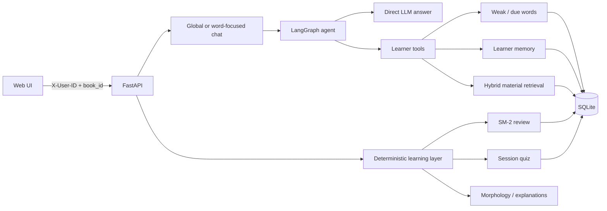
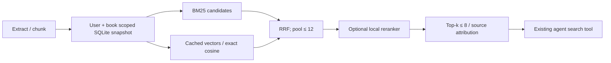

# LinguaPilot

LinguaPilot is an AI-assisted personal language-learning application built around a single LangGraph agent. It combines learner-aware tool calling with deterministic vocabulary study workflows, durable learner preferences, and source-attributed retrieval over uploaded learning materials.

## What it demonstrates

- LangGraph orchestration with optional tool calling instead of calling a learner tool on every message
- Runtime-scoped learner tools for weak words, due reviews, saved learner memory, and uploaded materials
- Explicit `User → Books → learner data` ownership backed by SQLite
- Persistent, allowlisted preferences, goals, and recurring confusions
- SM-2 review scheduling and deterministic quiz-to-card updates
- Measured retrieval alternatives: BM25, an exact local vector index, RRF hybrid fusion, bounded reranking, and source attribution
- A 24-query retrieval benchmark with Recall, MRR, nDCG and an explicit promotion gate; negative results retained
- PDF, TXT, Markdown, and CSV material ingestion
- FastAPI APIs, a lightweight vanilla JavaScript UI, and Docker support
- Deterministic agent evaluation with an optional, separately invoked live-model suite

## Architecture


```mermaid
flowchart LR
    UI["Web UI"] -->|"X-User-ID + book_id"| API["FastAPI"]
    API --> CHAT["Global or word-focused chat"]
    CHAT --> AGENT["LangGraph agent"]
    AGENT --> DIRECT["Direct LLM answer"]
    AGENT --> TOOLS["Learner tools"]
    TOOLS --> WEAK["Weak / due words"]
    TOOLS --> MEMORY["Learner memory"]
    TOOLS --> RAG["Hybrid material retrieval"]
    WEAK --> DB[("SQLite")]
    MEMORY --> DB
    RAG --> DB

    API --> STUDY["Deterministic learning layer"]
    STUDY --> SM2["SM-2 review"]
    STUDY --> QUIZ["Session quiz"]
    STUDY --> VOCAB["Morphology / explanations"]
    SM2 --> DB
    QUIZ --> DB
```

SQLite stores user-owned books, JSON-compatible learner state, conversations, memory, and material indexes. Runtime databases and learner data are intentionally excluded from Git.

## Agent workflow

For a chat request, the application supplies the active `user_id`, selected `book_id`, conversation history, saved response preferences, and an optional focus word. `user_id` and `book_id` are runtime context; the model cannot choose either value as a tool argument.

The agent can:

- answer a general language question directly;
- call `get_weak_words` for evidence-backed vocabulary weaknesses;
- call `get_due_words` for already-studied cards whose review time has arrived;
- call `get_learner_memory` for saved preferences, goals, and recurring confusions;
- call `search_learning_materials` for book-scoped, source-attributed excerpts.

Tool results return bounded evidence to the agent, which then produces the final response. Writes such as SM-2 grades, quiz results, material management, and durable-memory extraction remain deterministic backend operations rather than model-authored state changes. If agent execution fails, plain chat retains a logged legacy LLM fallback.

## Retrieval and persistence

Material ingestion supports PDF/TXT/Markdown/CSV and baseline or paragraph chunking. The modern experimental path combines **BM25 + cached dense vectors → RRF → bounded local reranking → attributed evidence**. A Python exact-cosine index fits the current local application without a vector database service. The original TF-IDF-style scorer and weighted hybrid remain reproducible baselines.


```mermaid
flowchart LR
    I["Extract / chunk"] --> S["User + book scoped SQLite snapshot"]
    S --> B["BM25 candidates"]
    S --> D["Cached vectors / exact cosine"]
    B --> F["RRF; pool ≤ 12"]
    D --> F
    F --> R["Optional local reranker"]
    R --> E["Top-k ≤ 8 / source attribution"]
    E --> T["Existing agent search tool"]
```

**Evidence retained the simpler default.** BM25 tied the old lexical baseline; reranking produced no quality gain, and paragraph chunking slightly reduced nDCG. The default is still `legacy` (including its optional original weighted embeddings), fixed/boundary-aware 900/120 chunks, and no reranker. Set `LANGBUDDY_RETRIEVAL_MODE` to `bm25`, `dense`, or `hybrid` to select an experimental alternative; enable `LANGBUDDY_RERANK=enabled` only for these modern modes.

The offline comparison uses 12 synthetic lessons, 24 inspectable queries, graded source judgments, and exact evidence anchors. Dense runs below use deterministic **token-hash test vectors**, not OpenAI or learned semantic embeddings. They cannot support a production semantic-quality claim or promotion.

| Configuration | Recall@3 | Hit@3 | MRR@3 | nDCG@3 | median ms | p95 ms |
|---|---:|---:|---:|---:|---:|---:|
| legacy | 0.875000 | 0.916667 | 0.916667 | 0.902186 | 0.244 | 0.268 |
| legacy_weighted | 0.895833 | 0.916667 | 0.916667 | 0.907924 | 0.590 | 0.637 |
| bm25 | 0.875000 | 0.916667 | 0.916667 | 0.902186 | 0.268 | 0.301 |
| dense | 0.770833 | 0.833333 | 0.833333 | 0.811613 | 0.402 | 0.436 |
| hybrid | 0.895833 | 0.916667 | 0.916667 | 0.907924 | 0.666 | 0.716 |
| hybrid_rerank | 0.895833 | 0.916667 | 0.916667 | 0.907924 | 0.812 | 0.947 |
| bm25_paragraph | 0.875000 | 0.916667 | 0.916667 | 0.900684 | 0.298 | 0.341 |

Metrics are evidence-qualified source metrics at three returned chunks. Timings measure a deterministic local workload, vary by machine/run, and exclude network, SQLite IO and extraction. A candidate needs at least +0.02 nDCG with no Recall/MRR regression to replace the incumbent. See [retrieval design and lifecycle](docs/RETRIEVAL_DESIGN.md), [benchmark protocol](benchmarks/retrieval/PROTOCOL.md), and [full per-query results](evaluation_results/retrieval_v1.json).

The default database is `state/langbuddy.sqlite3`. The storage layer enforces user/book isolation and provides a conservative, copy-only importer for older local `state/*.json` files. This public repository does not ship learner state or uploaded book copies.

## Key components

- `app/main.py` — FastAPI application, identity context, book import, review, and vocabulary routes
- `app/agent.py` — LangGraph workflow, learner/material tools, and observable tool-call trace
- `app/storage.py` — SQLite repository and legacy JSON migration
- `app/chat.py` — global and word-focused chat persistence plus fallback handling
- `app/memory.py` — conservative explicit learner-memory extraction and bounded views
- `app/materials.py` — document extraction, chunking, validated embedding cache and atomic material lifecycle
- `app/retrieval.py` — BM25, exact vectors, RRF, reranking and opt-in diagnostics
- `app/retrieval_baseline.py` — frozen original retrieval algorithm
- `app/retrieval_evaluation.py` — offline metrics, comparison and promotion gate
- `app/sm2.py` — SM-2 card updates
- `app/session_quiz.py` — quiz generation, scoring, feedback, and card updates
- `app/morph.py` — vocabulary parsing and morphology grouping
- `app/evaluation.py` — deterministic and optional live-model agent evaluation
- `static/` — framework-free HTML, CSS, and JavaScript interface
- `tests/` — deterministic storage, agent, retrieval, migration, and evaluation tests

## Running locally

Requirements: Python 3.10 or newer.

```bash
git clone https://github.com/zhangxyqqq/linguapilot-agent.git
cd linguapilot-agent

python3 -m venv .venv
source .venv/bin/activate
python -m pip install --upgrade pip
pip install -r requirements.txt

cp .env.example .env
```

Add your own OpenAI API key to `.env` to enable LLM chat and semantic embeddings. Never commit `.env`. Configuration options are documented in the sanitized `.env.example`; set `LANGBUDDY_EMBEDDINGS=disabled` for lexical-only retrieval.

Start the application:

```bash
uvicorn app.main:app --reload --host 127.0.0.1 --port 8000
```

Open [http://127.0.0.1:8000](http://127.0.0.1:8000). On a clean checkout, import `data/book_sample.csv` from the **Vocabulary** page to create a sample book. The health endpoint is available at `/health`.

### Docker

```bash
docker build -t linguapilot .
docker run --rm -p 8000:8000 \
  -e OPENAI_API_KEY="$OPENAI_API_KEY" \
  -v "$(pwd)/state:/app/state" \
  linguapilot
```

The mounted state directory keeps the SQLite database outside the container image.

## Tests and evaluation

Run the deterministic regression suite:

```bash
pytest -q
```

The retrieval milestone suite contains 72 passing tests, including all 33 original regressions. It covers BM25, vector mapping/cache invalidation, fusion/reranking, concurrent deletion and replacement, user/book isolation, source attribution, metric correctness, promotion behavior, learner memory, SM-2/quiz updates and agent routing. External HTTP transports are blocked during deterministic tests.

Run the independent retrieval comparison (no paid calls), writing fresh output to a temporary directory so the retained milestone evidence is not overwritten:

```bash
rag_eval_dir="$(mktemp -d)"
python -m app.retrieval_evaluation --output "$rag_eval_dir/retrieval.json"
```

The quality metrics, per-query rankings, and promotion decision should reproduce the retained report; wall-clock timings and runtime environment metadata can differ.

Historical baseline output is preserved separately in `evaluation_results/retrieval_pre_upgrade.json`. New agent milestone results are in `evaluation_results/agent_rag_milestone.md`; the original agent report remains unchanged.

Run the deterministic agent evaluation and produce machine- and human-readable reports:

```bash
agent_eval_dir="$(mktemp -d)"
python -m app.evaluation --mode deterministic \
  --json-output "$agent_eval_dir/agent.json" \
  --summary-output "$agent_eval_dir/agent.md"
```

The committed deterministic baseline evaluates tool selection, unnecessary tool avoidance, learner-memory usage, weak/due routing, RAG routing, source attribution, user/book isolation, and graceful fallback. It uses a fixed routing model but executes the real graph and tools; it does not use an LLM judge.

An optional live-model run is available but is not required for deterministic validation:

```bash
python -m app.evaluation --mode live \
  --json-output evaluation_results/live.json \
  --summary-output evaluation_results/live.md
```

## Limitations

- `X-User-ID` provides stable local identity and data isolation, but it is not authentication or authorization.
- SQLite is suitable for this local/single-service application, not a horizontally scaled multi-writer deployment.
- LLM-backed features and semantic retrieval require the developer to supply an external API key and may incur provider costs.
- The frontend is intentionally lightweight and does not include a production account-management flow.
- Learner-memory extraction is deliberately limited to explicit, allowlisted statements.
- Live-model behavior is probabilistic. Agent evaluation checks routing contracts; the small synthetic retrieval benchmark has no held-out split or independent relevance annotation.
- Hash-vector results do not measure learned semantics. Exact vector scans and short sample documents provide no large-corpus scalability evidence. PDF citations retain source/chunk identifiers, not page coordinates.
- The Dockerfile and dependencies are unchanged; container execution was not revalidated because the local Docker daemon was unavailable.
- The repository does not include a hosted deployment configuration or production monitoring stack.

## Project context

LinguaPilot originated as an academic special-course language-learning system focused on vocabulary grouping, review, quizzes, and explanations. It was subsequently extended into an agent-oriented portfolio project with LangGraph orchestration, learner-aware tools, persistent learner memory, isolated SQLite storage, hybrid material retrieval, and deterministic agent evaluation.

## Job-search milestone

Source scope frozen after deterministic acceptance checks. See [factual evidence summary](docs/JOB_SEARCH_RAG_SUMMARY.md), [interview code map](docs/INTERVIEW_RAG_MAP.md), and [freeze record](docs/RAG_MILESTONE_FREEZE.md).
