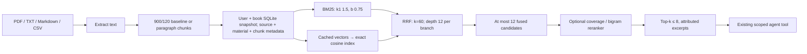

# Retrieval engineering milestone

LinguaPilot remains a language-learning assistant: one LangGraph agent, runtime
user/book scope, four learner tools, SQLite state, deterministic SM-2/quiz writes,
FastAPI, and the existing frontend. Retrieval diagnostics are backend concerns.

## Inspected baseline

Revision `381fbc56e92e31b7f78ecf1043a29a7c179d5a4a` had 33 passing tests.
`app/materials.py` extracted UTF-8 TXT/Markdown/CSV and PDF text with pypdf.
It used 900-character chunks with 120-character overlap, looking backward for a
space/newline in the latter half of the window. This is already boundary-aware,
not a purely fixed byte splitter. PDF pages were joined; page numbers and CSV
row/Markdown heading structures were not preserved as separate metadata.

The lexical scorer used smoothed IDF and cosine normalization **only over query
terms**, so it is a TF-IDF-style baseline rather than full-vector TF-IDF. A
single-term match often scores 1 regardless of document length or frequency.
Optional cached OpenAI vectors were linearly combined at 0.45 lexical / 0.55
semantic; cosine >= 0.2 admitted semantic-only candidates. Original functions,
including rounding and tie ordering, are frozen in `app/retrieval_baseline.py`.
`evaluation_results/retrieval_pre_upgrade.json` records outputs before changes,
the original revision, and corpus/function-file SHA-256 digests. Neither it nor
the historical agent evaluation was overwritten by the new reports.

## Pipeline and choices

`app/retrieval.py` contains an explicit BM25 index, an exact normalized-vector
index, RRF, immutable configuration, and a reranker protocol. BM25 uses positive
Robertson IDF, saturating term frequency, and corpus-wide length normalization.
Query terms and ties are ordered deterministically. Modern ties use source name,
material ID, and chunk index; legacy ordering is unchanged.

The vector index is a Python in-memory exact cosine scan, rebuilt from the one
scoped snapshot already loaded for a query. There is no FAISS, Qdrant, new service,
or new dependency. At this local scale, a separate persisted ANN index would add
synchronization work without demonstrated benefit. Raw embeddings stay cached in
SQLite; normalized index entries map directly to chunk positions and source IDs.
Search costs O(chunks × dimensions); no scalability or ANN-speed claim is made.

RRF sums `1 / (60 + branch_rank)` over the BM25/dense candidate union. It avoids
cross-score calibration but does not imply better quality. The baseline weighted
fusion remains available. Candidate depth/pool default to 12 and are bounded
between 8 and 100; top-k is bounded to 8. The untrained reranker scores unique query
term coverage plus 0.25 times query-bigram coverage, only on the fused pool. Equal
reranker scores retain fused order. It is lexical, not a cross-encoder or LLM.

## Configuration and agent integration

The promotion decision retains `LANGBUDDY_RETRIEVAL_MODE=legacy`, baseline chunks,
and `LANGBUDDY_RERANK=disabled`. Legacy still optionally uses its original weighted
OpenAI embeddings when enabled. Its **lexical-only** behavior was measured; the
production OpenAI weighted behavior was not quality-validated by fake vectors.

Choose `bm25`, `dense`, or `hybrid` explicitly to exercise the modern path. `hybrid`
is BM25 + dense + RRF. `LANGBUDDY_RERANK=enabled` enables the bounded local reranker
for those modes. Legacy with reranking is rejected as an invalid configuration.
`LANGBUDDY_EMBEDDINGS=disabled` keeps retrieval offline. BM25 queries do not call
an embedding provider. Upload embedding caching follows the embeddings setting.

Python callers may pass `RetrievalConfig`, a `Reranker`, and a mutable `trace={}`
to `search_learning_materials_for_book`. Modern traces include query, mode,
branch counts, lexical/dense/fused/final ranks and scores, reranker scores,
source IDs, stage timings and fallback codes. Traces are opt-in and are never
persisted automatically. Legacy traces expose combined scoring and returned
ranks; the frozen algorithm has no separate candidate stages. Logs contain error
classes/codes, not queries, excerpts, credentials or provider exception messages.
Provider/SQLite latency is outside the algorithm stage timings.

The agent still chooses only a bounded query and result count. Runtime supplies
user/book IDs; the tool schema and graph topology are unchanged. The tool now
whitelists source/material/chunk IDs and at most eight 900-character excerpts,
so scores, vectors, trace timings and retrieval settings never enter the LLM.

## Lifecycle and failure behavior

- Upload generates a material ID and stable ordinal chunk indexes. Identical
  files uploaded twice remain distinct materials, preserving existing behavior.
- `add_material(..., replace_document_id=..., chunking=...)` replaces/rechunks a
  material atomically from newly supplied bytes and retains its material ID.
  Old chunks/vectors are removed together; changed chunk ordinals are not promised
  to refer to the same text. There is no extra frontend or replacement endpoint.
- Rechunking requires original bytes to be supplied again. Original uploads are
  not newly retained in a parallel storage system.
- Embeddings carry a provider model ID (including OpenAI dimensions) and text
  SHA-256. Missing, changed, malformed or legacy unhashed vectors are backfilled
  once; model/dimension changes invalidate the cache. A complete batch is
  validated for count, dimensions, finite numbers and nonzero norm before write.
- The derived vector/BM25 views are rebuilt from current chunks. There are no
  sidecar files to orphan on deletion or reset. A missing cached vector is safely
  regenerated when a provider is available; without one lexical search works.
- Material mutations use SQLite compare-and-swap under `BEGIN IMMEDIATE`.
  A cache fill that loses to deletion/replacement cannot resurrect old content;
  search reloads current state and falls back. Conflicting uploads/replacements
  fail explicitly and can be retried; they do not silently overwrite a winner.
- A query otherwise reads a snapshot: a delete after that read may still be
  represented in the in-flight response, but cannot reappear in persisted state.
- SQLite reads and writes are scoped by `(user_id, book_id)`. The optional legacy
  file adapter is a local/test compatibility path, not used by the API. Explicit
  users receive separate subdirectories; omission retains its historical single
  namespace. It does not offer SQLite's concurrent-writer guarantee.
- Missing/unavailable embeddings fall back to BM25 in modern modes (legacy uses
  its historical lexical scorer). A valid dense search with no matches returns
  no evidence. Reranker failure retains fused order. Empty corpus/query and
  unsupported, empty or malformed material are covered by deterministic tests.

## Benchmark and promotion

The protocol was written before comparison in `benchmarks/retrieval/PROTOCOL.md`.
The corpus has 12 original synthetic two-section lessons and 24 answerable
queries: exact, natural-language, ambiguity and two lexical-gap cases. Source
judgments use direct=2/supporting=1 grades plus an exact anchor that a returned
chunk must contain. Duplicate sources earn no additional credit but consume
rank positions. Metrics are evidence-qualified source Recall@3, Hit@3, truncated
MRR@3, and nDCG@3. This makes paragraph/fixed comparisons use the same relevance
units instead of changing the denominator with the number of chunks.

`python -m app.retrieval_evaluation` writes comparison JSON and Markdown, including
per-query outputs, full metric precision, settings, timing environment, median,
p95 and stage durations. Tests reproduce committed quality results, not timings.
See `evaluation_results/retrieval_v1.md` for measured results. Agent tool-routing
quality remains a separate eight-case suite in `app/evaluation.py`.

Only a >= 0.02 nDCG increase with no Recall/MRR regression can promote a lexical
candidate. Reranking also needs that improvement over its paired no-reranker run
and median <= 2× paired median + 1 ms. The chunking gate compares matching BM25
configurations. Fake dense scores are **ineligible** to promote production dense
or hybrid settings. No query-specific tuning, learned synonym map, or held-out
claims are made.

The fixed 256-dimensional signed SHA-256 token-hash embedder is an offline
fixture for vector plumbing. It is not semantic, has no learned knowledge, and
cannot find the car/automobile or teacher/instructor synonym probes. This benchmark
therefore validates mechanics and documents limits; it does not validate real
OpenAI embedding quality, latency, multilingual generalization or a trained
cross-encoder. All tests block external HTTP transports. Live APIs were not called.

## Adversarial review and remaining limits

Review covered cross-user/book reads, chunk/vector mapping, deleted-content
resurrection, cache atomicity and model/text invalidation, ranking order,
duplicate relevance credit, fake embedding leakage, and claims versus results.
Tests specifically reproduce concurrent cache deletion and competing uploads.
No benchmark query or judgment is imported by production retrieval; the test
embedder reads only tokens. Full original product regressions still run.

Small synthetic authored judgments can be incomplete and are not independently
annotated. There is no held-out dataset or statistical significance claim.
Documents are short (12 baseline versus 24 paragraph chunks), so no conclusions
about large PDFs or optimal overlap are supported. PDF attribution is filename
and chunk ordinal, not page coordinates; scanned PDFs need OCR outside this app.
Byte/character caps remain 5 MB / 1,000,000 extracted characters. User headers
provide local isolation, not authentication. Whole-store JSON and exact scans
are appropriate for this bounded local milestone, not a distributed system.
